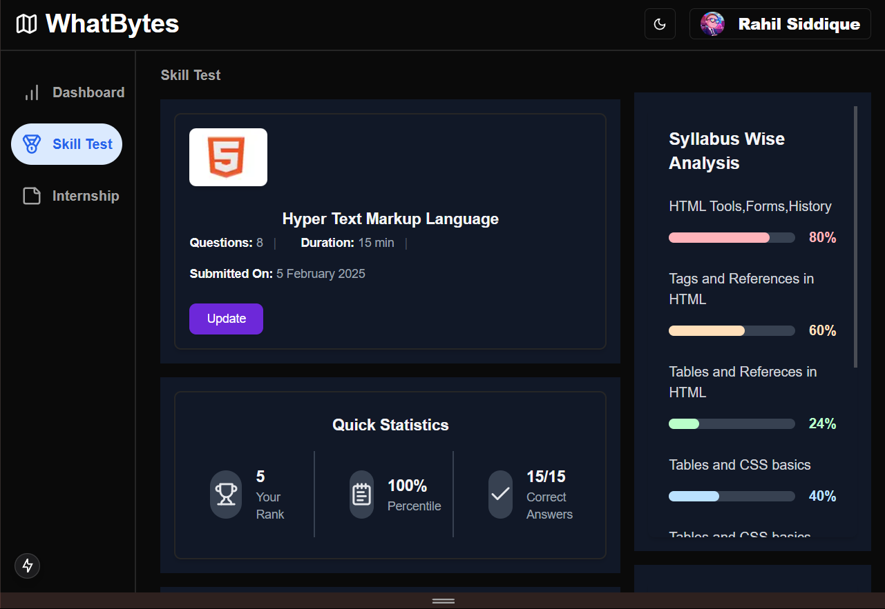
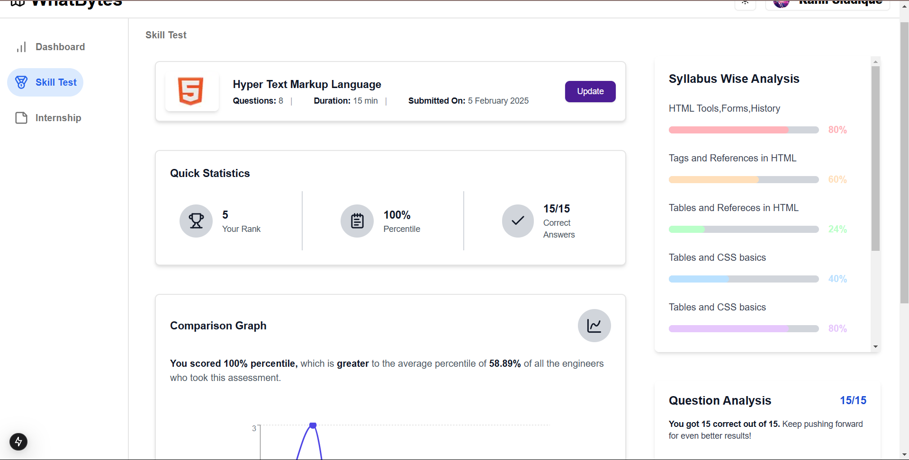
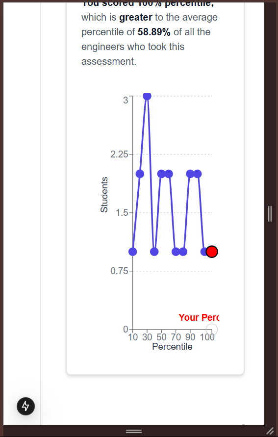

## Tech Stack and Libraries Used

NextJs,TailwindCSS,shadcn/ui,lucide-react,TS

## How to start

1. Clone the project into your system
2. cd into whatbytes folder
3. enter `pnpm install` to install all the required node modules
4. enter `pnpm run dev` to start it

## Various Folders

app:This contains the main code and routing
components:This one have various components being used
lib: Simple folder with a utils file
node_modules:All node modules are in this
public: Images and other public stuff provided deafult by NEXTJS no modifications done in this
readme-images:Contains images used in the readme file

## Some Working Screenshots

